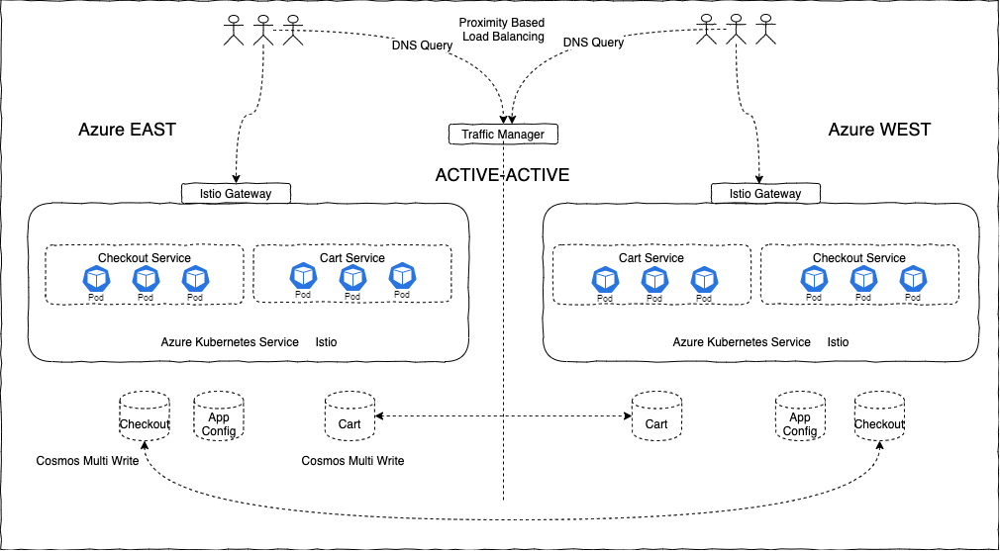
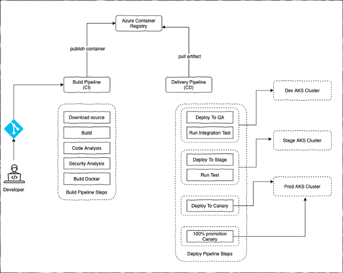

# Highly available microservices architecture deployment solution for e-commerce

# About
We will discuss the architecture of a cloud-native E-Commerce platform on the public cloud. We will discuss the problems on hand, the motivation behind building such a new platform, the Architecture guidelines and the operating principles we followed, the technology stack we choose, and the rationale behind such decisions.

These problems motivated us to build a new platform from scratch using modern technologies on the public cloud with the following high-level objectives:
- High performance, Massively scalable
- High quality
- Time to market
- Elastic
- Innovate
- Cost-effective
- Highly available
# Architecture Guidelines & Operating Principles
We set a few architecture guidelines and design patterns and followed them religiously.
- Best Of The Breed Technology
- Domain Oriented Microservice Architecture
- Containerised Deployments
- Stateless, Omni-channel & Massively Scalable
- Elastic
- Resiliency At The Core
- STOSA
- DevOps & Automation
- Observability
- Cost-effective

# Microservice Deployment Architecture
We followed an ACTIVE_ACTIVE model for achieving high throughput and HA/DR. The services are deployed in Azure EAST & WEST regions. 

# DevOps Practice
Every microservice is designed in such a way that it is owned by a single team. The team operates using the STOSA model (single team owned service architecture) where they have responsibility for architecture to development to testing to deployment to monitoring to addressing production issues. The development is using agile methodologies. The source code is stored in Git/Github and the team follows Trunk-based development as the branching strategy. For testing, the team depends on automated tests and the code is continuously tested using CI/CD pipeline. Here is the CI/CD model that team follows:

# Cost Management
Costing is a very important view of any architecture and we need to keep it in mind right from the beginning in Technology selection, Optimum cloud resource usage and monitoring cost reports.

# Conclusion
To sum up, it can be said that, there is a lot of thinking, research and hard work that has gone into building the platform, you don’t get everything right on the first attempt. The idea is to constantly monitor the systems, observe the system behaviour from production traffic and improve from every iteration.